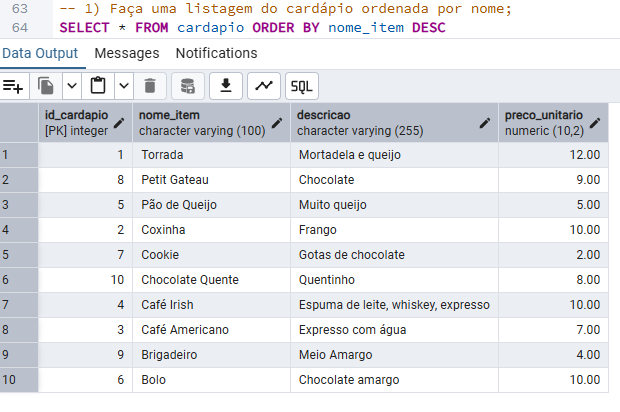
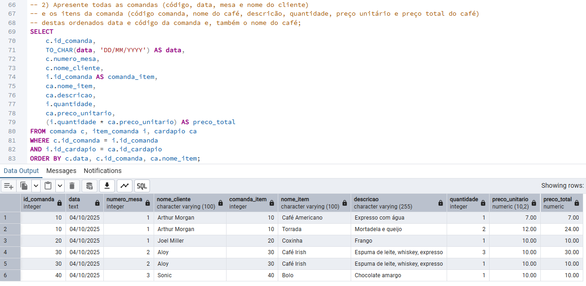
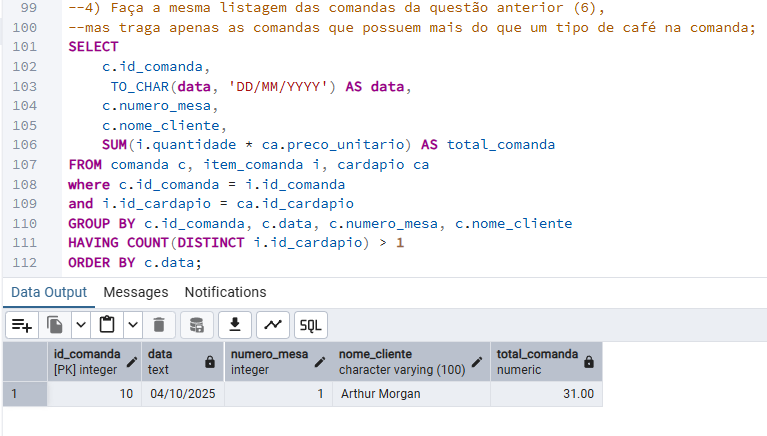
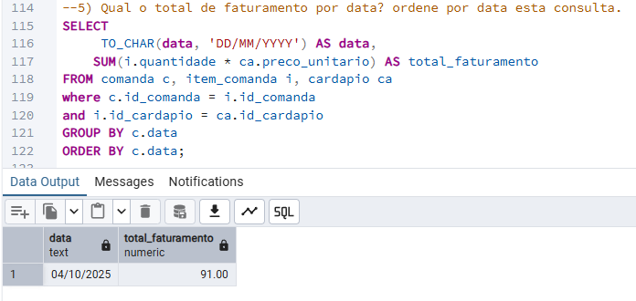

# Lista de Exercicio comandos SQL 📘

Este repositório contém a resolução de 5 exercicios em SQL do curso FullStack da +praTi

## Estrutura do Projeto 📎

O Projeto contém um arquivo .sql com os comandos nescessarios para:

- Criação do banco de dados 'bomgosto'.
- Criação das tabelas (comanda, cardapio e item_comanda).
- População com dados das tabelas.
- Comandos para visualizar as tabelas (estes que devem ser executados um de cada vez).
- Comandos para a resolução dos 5 exercicios.

Contém também uma pasta 'ResolucaoPrint' com prints dos resultados dos comandos de cada atividade.

## Execução da atividade ✏

Recomendo o uso do PostgresSQL versão 17.6.
A instalação pode ser feita por meio do [site oficial](https://www.postgresql.org/).

Os comandos podem ser executados dentro do Query do pgAdmin instalado junto ao PostgressSQL.

## Exercicios e resoluções

1. — Faça uma listagem do cardápio ordenada por nome.

- Resolução: 
  

2. — Apresente todas as comandas (código, data, mesa e nome do cliente) e os itens da comanda (código comanda, nome do café, descricão, quantidade, preço unitário e preço total do café) destas ordenados data e código da comanda e, também o nome do café.

- Resolução: 
  

3. — Liste todas as comandas (código, data, mesa e nome do cliente) mais uma coluna com o valor total da comanda. Ordene por data esta listagem.

- Resolução: 
  

4. — Faça a mesma listagem das comandas da questão anterior (6), mas traga apenas as comandas que possuem mais do que um tipo de café na comanda.

- Resolução: 
  

5. — Qual o total de faturamento por data? ordene por data esta consulta.

- Resolução: 
  
